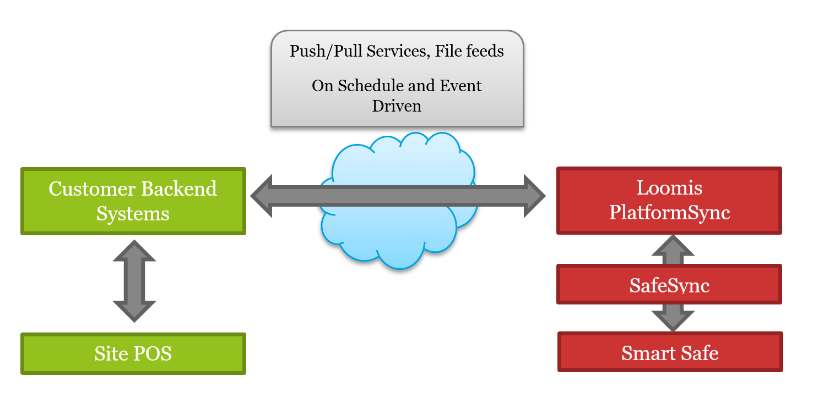

# Loomis SafePoint PlatformSync

API (PlatformSync) documentation can be found here: https://loomis-us-sp.github.io/PlatformSync/ 

# Platform Sync Overview

This working document provides information on how Loomis PlatformSync ("API") can integrate with customer systems.

With SafePoint by Loomis, the Smart Safe ("Safe") integrates only to the back-end Loomis system, SafeSync. SafeSync allows Loomis to connect in a variety of ways with multiple manufacturer models and connection methods.

## Connection Methods

### Customer Internet

Uses the site's existing internet connection allowing safe to connect to Loomis without requiring Loomis to traverse the customer's network.

### Loomis Cellular Modem

Deployed inside the safe and offers a turn-key solution, without having to engage customer IT allowing Loomis a direct, bi-directional connection to the safe.

### VPN

Customer-to-Loomis VPN tunnel, requiring configuration, planning, and setup from Loomis and customer network engineers in order for Loomis to traverse customer network to connect to safe.

## SafeSync

Loomis' SafeSync platform is a multi-node, highly scalable and fault tolerant platform designed to support the above connection methods while simultaneously communicating with thousands of safes at any one time. SafeSync allows Loomis to initiate the connection to safes once per hour (at the moment), or allows the safes to initiate the connection to Loomis through the internet to connect to Loomis on a much more frequent basis. Data exchanged between SafeSync and the safe is AES encrypted using a 256bit key configured on the safe during manufacturing. 

SafeSync monitors the safe's sensors to ensure proper operation of all components including door sensors and validators. While the OS level functions are not exposed to any layer of the software stack, the safe software reports any potential issues through the proprietary protocol established between Loomis and the manufacturer. This layer of abstraction allows a measure of security and protection against tampering with the lower level OS functions.

## Benefits of PlatformSync
Due to nature of connection methodology, security and integrity of the information residing in the safe, Loomis provides customers the ability to integrate their backend systems with Loomis PlatformSync rather than individual safes. This allows customers to remain immune to changes to safe software/configurations, data and transaction mutations, hardware and software failures, and take advantage of software infrastructure that Loomis has invested in since 2008 supporting thousands of customers over tens of thousands of safes. In addition, this ensures that inadvertent changes or failures on the safe do not adversely affect customer site POS systems.

With Loomis PlatformSync, customers can offer end points for direct integration or invoke Loomis PlatformSync APIs to gather data about their safes. 

Below is a high level representation of how Loomis PlatformSync can integrate with customer back-end systems.

## Serial Number
As messages are exchanged between the Loomis PlatformSync and customer endpoints, accurately identifying individual safes on both ends will be crucial. The most natural mechanism for this is the unique alphanumeric serial number assigned to the safe by the manufacturer. The serial number varies in format length by manufacturer and model. 

Examples include: 

- UT01234
- CT57679
- LS2017031453

## Push API

Loomis PlatformSync can push data to customer provided end points. Customers can develop these technology agnostic end points as long as they meet the basic minimum common requirements and conform to schema for the expected set of messages. With the [Push API](https://loomis-us-sp.github.io/PlatformSync/#push-api), customers are responsible with ensuring the end point is up and running at all times.

- Common attributes of all customer provided end points
    - HTTPS POSTs
    - Implement agreed upon authentication and security protocols
    - JSON payloads - pre configured in Loomis PlatformSync
- Event Driven
    - An Event Driven feed allows customers to receive data for one or more safes as the Loomis SafeSync platform collects data from the safe. For example, in the Transactions Message an event could be a specific type of transaction that occurs on the safe. Customers can register the type of transaction they are interested in with Loomis PlatformSync. When any safe generates the specified transactions, and after SafeSync downloads and processes the transaction, then Loomis PlatformSync will push the transactions for any safe collected since the last time the end point was invoked.
    - A customer provided end point that supports a live feed should first and foremost account for load and scale. As the number of data points or transactions and safes increase the higher the demand that will be placed on the customer end point.
    - Loomis PlatformSync will push transactions in batches to mitigate any capacity limitations on the customer side.
- Recovery, Retries and SLA
    - Loomis PlatformSync will retry any message that returns anything other than a HTTP Status Code 200 for a period of 24 hours. Any end point that fails to respond within three minutes will be considered abandoned and a retry will be attempted.
    - Loomis PlatformSync will send a notification to the customer and Loomis Support teams for any end point that fails to accept a message.
    - After the 24 hour period, if Loomis PlatformSync is unable to deliver the message, the message is discarded and the customer will be notified again.
    - While Loomis engineers work to ensure High Availability for Loomis PlatformSync, recovery is built in to minimize down time and data integrity. Loomis PlatformSync will track data not submitted during any planned or unplanned outage and ensure delivery upon restoration of services.

### Push Endpoint Requirements

When utilizing the Push mechanism for the Transactions Message, customers will be responsible for implementing an end point that implements a specific schema. Customer provided [end point(s)](https://loomis-us-sp.github.io/PlatformSync/#endpoint-urls) must
- Accept HTTPS POST only
- Accessible over Internet
- Use HTTPS only
- JSON - pre-determined and stored in Loomis PlatformSync
- Implement API Key (Bearer Token) 
- Accept a list of transactions with defined data points
    - List may contain more than one safe (serial number)

Loomis PlatformSync will invoke a set of pre-configured end points. A payload posted to the end point(s) can contain one or more safes.

In the event of an outage, either minor or extended, when Loomis PlatformSync comes back on line, any pending transactions that have yet to be posted will be sent to the customer end point(s).

Loomis PlatformSync will ensure that duplicate transactions for any safe are not posted.

### Security

Security should be implemented as long-lived [bearer tokens (or API Keys)](https://loomis-us-sp.github.io/PlatformSync/#security).

## Messages

Loomis PlatformSync provide a number of messages for customers to consume that offer a variety of information. Each message type contains identifying information for a specific location and safe.

### Transactions

At the core of Loomis PlatformSync Messages, is the [Transactions Message](https://loomis-us-sp.github.io/PlatformSync/#transactions) containing a list of individual transactions made by users at a specific date/time. These transactions are generated by the safe on a regular basis throughout the use of the safe. While most transaction types are generated by users, there are a few transactions that are safe generated, but all follow the same general schema.

## Environment and SLAs

Loomis PlatformSync is hosted and operated by Loomis within a Loomis managed data center in Houston, TX. The entirety of the infrastructure required to operate Loomis PlatformSync and all backend systems is provisioned and maintained by Loomis system, network and software engineers. 

While Loomis engineers have built redundancy and fault tolerance at all levels from servers to network equipment and the software systems, unforeseen events may occur that result in a loss of uptime for Loomis PlatformSync. 

Loomis Support personnel will work to ensure customers are notified of any downtime that may occur as a result of planned or emergency outages. In addition Loomis PlatformSync provide recovery capabilities to ensure loss of data does not occur and the process resumes as normal.

## Changes and Updates

Loomis reserves the right to make modifications and enhancements to the Loomis PlatformSync, to support customer requests, fix issues and offer new features.

These enhancements will be available transparently to customers on compatible version of Loomis PlatformSync. If a set of changes are not compatible with the previously available version, Loomis will provide a new version that will be available to customers as needed.

Changes to Loomis PlatformSync will be communicated with customers prior to release to ensure awareness and compatibility. 

### Versioning

As Loomis PlatformSync are updated with new features and fixes, changes that are not compatible with existing implementations will be deployed under a new version. Customers using an existing version will remain unaffected and can make use of updated versions when ready. Omission of the desired API version will result in the latest version of the API to be used.

If a version is deprecated or obsolete, customers will be notified to upgrade their systems to latest versions.

